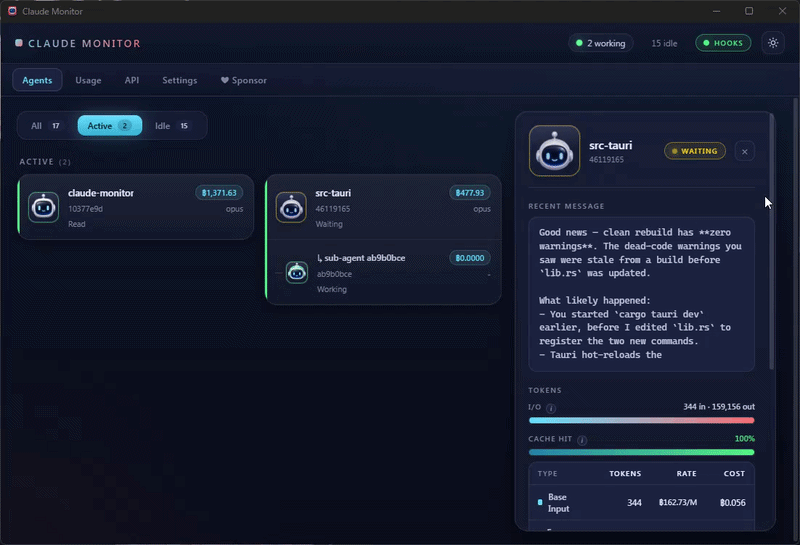

# Claude Monitor

> A modern desktop dashboard that watches your Claude Code agents in real time —
> like a task manager for your AI assistants.

**Pure Rust** — Tauri 2 backend + Leptos 0.8 (CSR) WASM frontend, Rust 2024 edition.
No JavaScript framework. Light + dark themes. ~10 MB binary.

## Demo



---

## 💾 Download

Prefer to install instead of build from source? Grab the latest installers from the
[**Releases page**](https://github.com/pakpoomsr/claude-monitor/releases/latest) —
no GitHub login required.

| Platform | File | Notes |
|---|---|---|
| **Windows (x64)** | `Claude Monitor_<ver>_x64-setup.exe` *(NSIS)* or `.msi` | WebView2 required (preinstalled on Win 10/11; installer prompts otherwise) |
| **macOS (Apple Silicon)** | `Claude Monitor_<ver>_aarch64.dmg` | First run: right-click → **Open** to bypass Gatekeeper |
| **macOS (Intel)** | `Claude Monitor_<ver>_x64.dmg` | Same Gatekeeper bypass on first run |
| **Linux (universal)** | `claude-monitor_<ver>_amd64.AppImage` | `chmod +x` and run; no install needed |
| **Linux (Debian/Ubuntu)** | `claude-monitor_<ver>_amd64.deb` | `sudo apt install ./claude-monitor_<ver>_amd64.deb` |
| **Linux (RHEL/Fedora)** | `claude-monitor-<ver>-1.x86_64.rpm` | `sudo rpm -i claude-monitor-<ver>-1.x86_64.rpm` |

> ⚠️ Windows binaries aren't code-signed yet — SmartScreen will warn on first run.
> Click **More info → Run anyway**. macOS binaries aren't notarized either, hence
> the right-click → Open dance. Both are on the roadmap once a signing cert is sorted.

If your platform isn't listed, the [Quick start](#-quick-start) below builds from
source — it's a single `cargo tauri build`.

---

## ⚡ Quick start

```bash
# 1. one-time toolchain setup
rustup target add wasm32-unknown-unknown
cargo install trunk
cargo install tauri-cli --version "^2"

# 2. clone + run
git clone https://github.com/pakpoomsr/claude-monitor
cd claude-monitor
cargo tauri dev
```

That's it. The first launch auto-registers Claude Code hooks (with a backup of
your `settings.json`) so the dashboard updates live the moment you start a
`claude` session in any terminal.

---

## 📦 Install

### Prerequisites

| Tool | Version | Why |
|---|---|---|
| **Rust** | 1.85+ (2024 edition) | toolchain — `rustup install stable` |
| **WASM target** | `wasm32-unknown-unknown` | frontend compiles to WASM |
| **Trunk** | latest | Leptos/WASM bundler |
| **Tauri CLI** | 2.x | desktop build orchestrator |

```bash
rustup install stable
rustup target add wasm32-unknown-unknown
cargo install trunk
cargo install tauri-cli --version "^2"
```

### Platform-specific system deps

<details>
<summary><b>Windows</b> — usually nothing extra</summary>

WebView2 is required (preinstalled on Windows 10/11). If your machine doesn't
have it: https://developer.microsoft.com/microsoft-edge/webview2/
</details>

<details>
<summary><b>macOS</b> — Xcode CLT</summary>

```bash
xcode-select --install
```
</details>

<details>
<summary><b>Linux</b> — webkit2gtk + friends</summary>

Debian/Ubuntu:
```bash
sudo apt install libwebkit2gtk-4.1-dev build-essential curl wget file \
  libxdo-dev libssl-dev libayatana-appindicator3-dev librsvg2-dev
```

Other distros: see https://tauri.app/start/prerequisites/
</details>

### Build a release bundle

```bash
cargo tauri build
```

Produces a native installer in `src-tauri/target/release/bundle/`:
- Windows → `.msi` / `.exe`
- macOS → `.dmg` / `.app`
- Linux → `.AppImage` / `.deb` / `.rpm`

---

## ▶️ Using Claude Monitor

### Run it

```bash
cargo tauri dev      # dev mode with hot-reload (frontend on :1420)
cargo tauri build    # release bundle for distribution
```

### First launch — what happens

1. The app opens to the **Agents** tab. Empty until you run `claude` somewhere.
2. An embedded HTTP server starts on `127.0.0.1:<random_port>` for hook events.
3. Your `~/.claude/settings.json` is **backed up to `settings.json.bak`** (one-time)
   and **11 hook entries are auto-registered**. Each is tagged `_claude_monitor: true`
   so they can be cleanly removed later.
4. Claude Code picks up the new hooks live — **no restart needed**.

> ✅ Dashboard updates within a second of every PreToolUse / Stop / Notification
> from any active `claude` session, anywhere on your machine.

### The six tabs

| Tab | What you see |
|---|---|
| 🟢 **Agents** | Live grid — one tile per Claude session, color-coded by status, with parent / sub-agent grouping. Click a tile for the detail pane (last message, in-flight tool, **5-column cost breakdown** — Base Input / 5m Cache Write / 1h Cache Write / Cache Hit & Refresh / Output — **I/O + cache-hit meters**, plus a live **Recent events** stream of every captured tool call, hook, and assistant turn). |
| 📊 **Usage** | Local SQLite history. **Range-aware totals card** (Tokens / Cache / Cost / Sessions / Events) that respects the active date filter, per-day cost bars, and **five breakdown sections** — by Project, by Model, by Core tools, by Shell commands, by Activity — each as a horizontal-bar list with share %. Project / Model show real cost; tool / shell / activity show approx cost (session $ split per event, labeled italic). **Last 7d / 30d / Custom** range pills. |
| 🕓 **History** | Per-session timeline of every `Edit` / `Write` / `MultiEdit` / `NotebookEdit` Claude has made. Click an edit for a unified diff (green +/red − colored). **Revert** rolls the file back to its pre-edit state — and itself is reversible (a `pre-restore` snapshot is captured before overwriting, so an unwanted revert can be undone from the same UI). 1 MB per-file cap, 14-day retention by default. Hook-driven (real-time hooks must be enabled). |
| 🌐 **API** | Optional Anthropic billing-API view (paste a key — kept in memory only, never written to disk). |
| ⚙️ **Settings** | Hook setup, state-machine thresholds, **editable per-model pricing** (13 SKUs × 5 cells, sourced from Anthropic's pricing page), **display currency** dropdown (10 currencies, FX rates from Frankfurter cached daily), **snapshots** toggle + retention days + disk usage. |
| ❤ **Sponsor** | Quick links to GitHub Sponsors, Buy Me a Coffee, and the issue tracker. Opens in your default browser. |

### Status legend

| | Status | What it means |
|---|---|---|
| 🟢 | **Working** | Assistant or tool currently in flight |
| 🟡 | **Waiting** | Turn ended — Claude wants your input (or stuck on a permission prompt) |
| ⚪ | **Idle** | No activity for `idle_timeout_secs` (treated as ended/historical) |
| 🔴 | **Error** | (reserved) |

### Themes

Click the **sun/moon icon** in the top-right to toggle between dark and light.
Choice is remembered via `localStorage`. If you've never picked one, it follows
your OS `prefers-color-scheme`.

### Disabling hooks

Settings → **Disable hooks**. The app removes its tagged entries from
`~/.claude/settings.json` and writes `hooks_enabled: false` to
`<data_local_dir>/claude-monitor/prefs.json`. Subsequent launches won't
re-register until you click **Set up hooks** again.

When hooks are off, the JSONL fallback (file-tailing `~/.claude/projects/**/*.jsonl`)
still keeps the dashboard working — just less precisely.

---

## 🌟 Features

- **Live agent grid** — one tile per Claude Code session, color-coded by status
- **Parent / sub-agent grouping** — Task-tool sub-agents nest under their parent
  with `↳ sub-agent <id>` rows; the group's headline status is the most-active
  member, so a parent "Waiting on its sub" is correctly counted as **Working**
- **Filter pills** — All / Active / Idle on the Agents tab
- **Detail pane** — last assistant message, in-flight tool, **I/O bar**,
  **cache-hit gauge**, **5-row cost table** (Base Input / 5m Cache Write /
  1h Cache Write / Cache Hit & Refresh / Output, with rate × tokens = cost
  per row, summing to the displayed total), project path, and a **Recent
  events** stream — newest-first scrollable log of every captured tool call,
  hook event, and assistant turn for the selected agent
- **Per-agent event log** — bounded ring buffer (500 entries / agent) for
  live streaming + SQLite-backed history that survives restarts; on
  selection the pane backfills the last 200 entries and then appends new
  events as they arrive
- **Editable per-model pricing** — 13 SKUs from Opus 4.7 down to Haiku 3,
  each with the five Anthropic price columns. Defaults match
  [the official pricing page](https://platform.claude.com/docs/en/about-claude/pricing);
  edit any cell in Settings and the whole UI re-costs instantly.
- **Currency conversion** — pick from 10 currencies (USD, EUR, GBP, JPY,
  CNY, THB, SGD, INR, KRW, AUD); rates fetched from
  [Frankfurter](https://www.frankfurter.app/) (free, no API key, ECB-sourced)
  and cached for 24h.
- **Real-time hooks** (auto-on) — PreToolUse / Stop / Notification / SubagentStart
  → embedded localhost HTTP server with constant-time token auth. Far more
  accurate than file-tailing.
- **JSONL fallback** — when hooks aren't registered (or for sessions that started
  before they were), status is inferred from `~/.claude/projects/**/*.jsonl` with
  a state machine that includes the `system/turn_duration` end-of-turn marker
- **Local usage history** — SQLite-backed token and cost rollups; range-aware
  totals (Tokens / Cache / Cost / Sessions / Events), per-day cost bars, plus
  **five breakdown sections** (Project / Model / Core tools / Shell commands /
  Activity) with share % bars. Project / Model carry real cost; tool / shell /
  activity show approx cost (session $ split evenly across events, labeled).
  Last 7d / Last 30d / Custom date-range selector
- **History tab — file diff & one-click rollback** — every `Edit` / `Write` /
  `MultiEdit` / `NotebookEdit` Claude makes is captured pre-edit and post-edit
  via hooks. Browse changes per session, view a unified diff, and **Revert**
  to the pre-edit state. Restore is itself reversible — a pre-restore snapshot
  is captured before overwriting. 1 MB per-file cap, configurable retention.
- **Shell command capture** — every Bash invocation Claude runs is logged with
  its command argument; powers the Usage tab's Shell-command breakdown
- **Optional Anthropic billing API** — paste a key, kept in memory only
- **Tray icon + toast** — toast pops up when an agent flips to Waiting
- **Light + dark themes** — modern glassy design language, reduced-motion friendly
- **Hardened by default** — strict CSP, owner-only file permissions on Unix,
  symlink-safe writes; see [SECURITY.md](SECURITY.md)

---

## ⚙️ Settings (defaults)

| Setting | Default | Meaning |
|---|---|---|
| `idle_timeout_secs` | 180 | Quiet for this long → Idle (history) |
| `permission_timeout_secs` | 7 | Tool pending this long → Waiting |
| `text_idle_secs` | 5 | Text-only turn quiet for this long → Waiting |
| `hook_grace_secs` | 30 | When to treat hooks as authoritative |
| `message_preview_chars` | 280 | Trim length for assistant message preview |
| `snapshots_enabled` | `true` | Capture pre/post file content on `Edit`/`Write`/`MultiEdit`/`NotebookEdit` (powers History tab) |
| `snapshot_retention_days` | 14 | Older snapshots are pruned on app startup |

---

## 🧠 How status detection works

There are **two signal sources** that converge on a single state machine in `AgentRegistry`:

### 1. Real-time hooks (authoritative — auto-on)

Hooks register **automatically on every app launch** (the URL/port refreshes each
time since the server binds to a random port). On first launch, the app:

1. Backs up `~/.claude/settings.json` to `settings.json.bak` (only if no backup exists yet)
2. Adds 11 hook entries (one per event) tagged with `_claude_monitor: true` so
   they can be removed cleanly. Each is `"type": "http"` pointing at
   `http://127.0.0.1:<random>/h` with an `X-Auth: <random>` header.
3. Claude Code picks the changes up live — no restart.

| Hook event | New status |
|---|---|
| `SessionStart` / `UserPromptSubmit` | Working (new turn — clears Waiting from previous Stop) |
| `PreToolUse` | Working (cancel waiting timers, push pending tool) |
| `PostToolUse` / `PostToolUseFailure` | (turn continues, pop pending tool) |
| `Stop` | Waiting (turn ended) |
| `Notification(permission_prompt | idle_prompt)` | Waiting |
| `PermissionRequest` | Waiting |
| `SubagentStart` | child agent spawned with `parent_id` set |
| `SubagentStop` / `SessionEnd` | natural decay → Idle |

Hook events bump `last_hook_at`. While that's recent (< `hook_grace_secs`,
default 30s), hooks are treated as ground truth.

### 2. JSONL fallback (always on)

When hooks aren't registered (or for sessions that started before they were),
status is inferred from `~/.claude/projects/<hash>/<session>.jsonl`:

| JSONL `type` + content | Event | Effect |
|---|---|---|
| any record with `cwd` | `SessionStart` | seeds project path |
| `system` `subtype: turn_duration` | `TurnEnd` | sets `awaiting_user = true` → Waiting |
| `assistant` `content[].text` | `AssistantText` | updates preview; arms 5s text-idle deadline on tool-free turns |
| `assistant` `content[].tool_use` | `ToolUseStart` | sets `had_tool_in_turn`; pushes pending tool |
| `assistant` `usage` | `Usage` | increments token counters + cost |
| `user` `content[].tool_result` | `ToolUseEnd` | removes pending tool |
| `user` (no `tool_result`) | `UserMessage` | new turn → Working |

A 1Hz tick loop re-evaluates with priority:
1. Quiet for `idle_timeout_secs` → **Idle**
2. Pending tool past `permission_timeout_secs` → **Waiting**
3. `awaiting_user` flag set → **Waiting**
4. Text-idle deadline reached on tool-free turn → **Waiting**
5. Otherwise → **Working**

### Sub-agent detection

Path-based: files at `<projects>/<proj>/<parent_uuid>/subagents/agent-<id>.jsonl`
are detected as sub-agents and registered with `parent_id = <parent_uuid>`. The
frontend groups them under their parent.

---

## 💰 Pricing (per million tokens, USD)

Defaults sourced from the [Anthropic pricing page](https://platform.claude.com/docs/en/about-claude/pricing).
**Edit any cell in Settings → Model pricing** — overrides persist in
`<data_local_dir>/claude-monitor/prefs.json` and take effect immediately.
"Reset all to defaults" returns to the values below and resets the display
currency to USD.

| Model | Base Input | 5m Cache Write | 1h Cache Write | Cache Hit & Refresh | Output |
|---|---:|---:|---:|---:|---:|
| Claude Opus 4.7 | 5.00 | 6.25 | 10.00 | 0.50 | 25.00 |
| Claude Opus 4.6 | 5.00 | 6.25 | 10.00 | 0.50 | 25.00 |
| Claude Opus 4.5 | 5.00 | 6.25 | 10.00 | 0.50 | 25.00 |
| Claude Opus 4.1 | 15.00 | 18.75 | 30.00 | 1.50 | 75.00 |
| Claude Opus 4 | 15.00 | 18.75 | 30.00 | 1.50 | 75.00 |
| Claude Sonnet 4.6 | 3.00 | 3.75 | 6.00 | 0.30 | 15.00 |
| Claude Sonnet 4.5 | 3.00 | 3.75 | 6.00 | 0.30 | 15.00 |
| Claude Sonnet 4 | 3.00 | 3.75 | 6.00 | 0.30 | 15.00 |
| Claude Sonnet 3.7 *(deprecated)* | 3.00 | 3.75 | 6.00 | 0.30 | 15.00 |
| Claude Haiku 4.5 | 1.00 | 1.25 | 2.00 | 0.10 | 5.00 |
| Claude Haiku 3.5 | 0.80 | 1.00 | 1.60 | 0.08 | 4.00 |
| Claude Opus 3 *(deprecated)* | 15.00 | 18.75 | 30.00 | 1.50 | 75.00 |
| Claude Haiku 3 | 0.25 | 0.30 | 0.50 | 0.03 | 1.25 |

The defaults table lives in `src-tauri/src/pricing.rs::default_pricing_table`
— update there when Anthropic changes a published rate.

---

## 🏗 Architecture

```
claude-monitor/
├── Cargo.toml                     # workspace root (edition 2024)
├── .github/workflows/             # build.yml (per-push) + release.yml (per-tag)
├── SECURITY.md                    # threat model + reporting
├── src-tauri/                     # native backend
│   ├── Cargo.toml
│   ├── tauri.conf.json
│   ├── capabilities/default.json  # Tauri capability scopes (incl. opener URLs)
│   └── src/
│       ├── main.rs                # Tauri commands, tray, app wiring
│       ├── watcher.rs             # tails ~/.claude/projects/**/*.jsonl, bounded reader
│       ├── parser.rs              # JSONL → ClaudeEvent (5-field TokenUsage)
│       ├── agents.rs              # AgentRegistry, state machine, tick loop, HookEvent
│       ├── hooks.rs               # axum HTTP server (constant-time auth, body cap)
│       ├── settings_writer.rs     # registers hooks; symlink-safe atomic writes
│       ├── prefs.rs               # prefs.json — hooks_enabled, pricing_overrides, currency
│       ├── pricing.rs             # ModelPricing/PricingTable + 13-SKU defaults
│       ├── currency.rs            # Frankfurter FX client + 24h cache logic
│       ├── db.rs                  # SQLite history (rusqlite, bundled) — sessions, agent_events,
│       │                          # file_snapshots; Usage-tab breakdown queries
│       ├── snapshots.rs           # File snapshot capture / diff / restore (History tab)
│       └── api.rs                 # Anthropic billing API client
└── frontend/                      # Rust → WASM via Trunk
    ├── Cargo.toml
    ├── Trunk.toml
    ├── index.html
    ├── styles/main.css            # modern glassy theme (light + dark tokens)
    └── src/
        ├── main.rs                # Leptos app shell, tab routing, theme, pricing/currency context
        ├── tauri_bridge.rs        # invoke / listen wrappers around window.__TAURI__
        ├── types.rs               # AgentStatus, AgentSnapshot, AgentGroup, Filter,
        │                          # HooksStatus, PricingTable, CurrencyState,
        │                          # format_money / format_date_short / format_datetime
        └── components/
            ├── agent_grid.rs      # group rendering with nested sub-agents
            ├── agent_detail.rs    # selected-agent inspector + 5-row cost table + meters
            ├── usage_panel.rs     # local SQLite usage — totals + day chart + 5 breakdowns
            ├── history_panel.rs   # History tab — sessions → edits → diff + Revert
            ├── diff_view.rs       # pure-CSS unified-diff renderer
            ├── api_usage_panel.rs # Anthropic billing-API view
            ├── settings.rs        # hook toggle, thresholds, pricing, currency, snapshots
            └── sponsor.rs         # Sponsor tab — outbound links via tauri-plugin-opener
```

---

## 🔌 Tauri commands (frontend ↔ backend)

| Command | Returns |
|---|---|
| `list_agents` | `Vec<AgentSnapshot>` |
| `get_agent { sessionId }` | `Option<AgentSnapshot>` |
| `get_agent_events { sessionId, limit?, includeHistory? }` | `Vec<LogEntry>` (live ring; falls through to SQLite for older entries) |
| `get_agent_settings` / `set_agent_settings { settings }` | `AgentSettings` |
| `hooks_status` | `HooksStatus { registered, url, port }` |
| `register_hooks` / `unregister_hooks` | `HooksStatus` |
| `get_daily_summary` / `get_weekly_chart` / `get_sessions { limit }` | SQLite history |
| `get_usage_range { startDate, endDate }` | `Vec<DayStats>` for any YYYY-MM-DD range |
| `get_usage_breakdown { startDate, endDate }` | `UsageBreakdown` (totals + day chart + 5 breakdown sections in one call) |
| `set_api_key { key }` / `fetch_api_usage` | Anthropic billing API |
| `get_pricing` / `set_pricing { table }` / `reset_pricing` | `PricingTable` (defaults + overrides) |
| `get_currency_state` / `set_active_currency { code }` / `refresh_currency_rates` | `CurrencyState { active, list, fetched_at }` |
| `list_session_snapshots { sessionId }` / `list_recent_snapshots { limit? }` | `Vec<SnapshotRow>` for the History tab |
| `get_snapshot_diff { snapshotId }` | `DiffResult { unified, plus, minus, … }` |
| `get_snapshot_content { snapshotId }` | base64 blob bytes (binary file viewer) |
| `restore_snapshot { snapshotId }` | `RestoreResult` (and emits `snapshot-restored`) |
| `purge_session_snapshots { sessionId }` | count deleted |
| `get_snapshot_settings` / `set_snapshot_settings { settings }` | `SnapshotSettings { enabled, retentionDays, totalSizeBytes, totalCount }` |

Events emitted to the frontend: `agent-status`, `agent-waiting`, `agent-event`
(per-entry payload for the live event log), `snapshot-restored` (History tab
refresh trigger).

External links from the Sponsor tab go through the `plugin:opener|open_url`
command (provided by `tauri-plugin-opener`); the URL allowlist lives in
`src-tauri/capabilities/default.json`.

---

## ⚠️ Caveats

- The hook HTTP server binds to a **random ephemeral port** on each app launch.
  The auto-register on launch refreshes the URL in `settings.json` so this is
  invisible — no manual action needed unless you've explicitly disabled hooks.
- The `tauri.conf.json` setting `app.withGlobalTauri: true` is required so the
  WASM bridge can use `window.__TAURI__.event.listen` — don't remove it. The
  exposure is mitigated by the strict CSP also set in `tauri.conf.json`
  (`default-src 'self'`, no remote scripts allowed).
- The CSP `connect-src` whitelist allows only `https://api.anthropic.com` and
  `https://api.frankfurter.app`. If you add a new outbound destination, update
  the policy too or fetch will be blocked.
- `beforeDevCommand` must run from `frontend/`, hence the `cd frontend &&`
  prefix — Tauri runs the command from the project root by default.
- Hook entries are tagged `_claude_monitor: true`. If you edit
  `~/.claude/settings.json` manually, leave that key alone or unregister via
  the app first.
- Bundle identifier is `com.claudemonitor.desktop` (not `.app` — that suffix
  collides with the macOS application bundle extension).

---

## 📄 License

MIT — see [LICENSE](LICENSE). Free for personal and commercial use, including
modification and redistribution; just keep the copyright notice.

---

## ❤️ Sponsor

Claude Monitor is free and MIT-licensed. If it saves you time watching your
agents, consider sponsoring continued work — it directly funds new features
on the roadmap below (per-project rollup, native rate-limit alerts, CSV
export, sprite skins).

- **GitHub Sponsors** — https://github.com/sponsors/pakpoomsr
- **Buy Me a Coffee** — https://buymeacoffee.com/pakpoomsr
- **Issues / feedback** — https://github.com/pakpoomsr/claude-monitor/issues

If you're using this in a team or company context and would like priority
features (team rollup, cloud sync, integrations), open a discussion — happy
to talk.

---

## 🛣 Roadmap

Recently shipped:

- [x] **History tab — file diff & one-click rollback** (issue #3): captures pre/post bytes for every Edit/Write/MultiEdit/NotebookEdit via hooks; reversible Revert
- [x] **Usage tab breakdowns** — Project / Model / Core tools / Shell commands / Activity, plus range-aware totals card
- [x] **Shell command capture** — Bash invocations logged with their command argument
- [x] Per-agent live event log in the detail pane (ring buffer + SQLite history; `agent-event` Tauri stream)
- [x] Editable per-model pricing (13 SKUs × 5 columns)
- [x] Currency conversion (Frankfurter, 10 currencies)
- [x] Custom date-range usage chart (Last 7d / 30d / Custom)
- [x] Sponsor tab with system-browser links
- [x] Security hardening (constant-time auth, strict CSP, symlink-safe writes — see [SECURITY.md](SECURITY.md))
- [x] Cross-platform CI: per-push `build.yml` + tag-driven `release.yml` (see `.github/workflows/`)

Still planned:

- [ ] Pin hook server to a fixed port so registrations survive restarts
- [ ] Native rate-limit alerts via `tauri-plugin-notification`
- [ ] Export CSV (Usage breakdowns, event log)
- [ ] Cross-edit diff in History (compare same file across two snapshots)
- [ ] Capture Bash file mutations (`sed -i`, `>`, `tee`) in the History tab
- [ ] Sprite skin picker
- [ ] Detect Claude Code subscription plan
- [ ] Code-sign the Windows installer to clear SmartScreen
